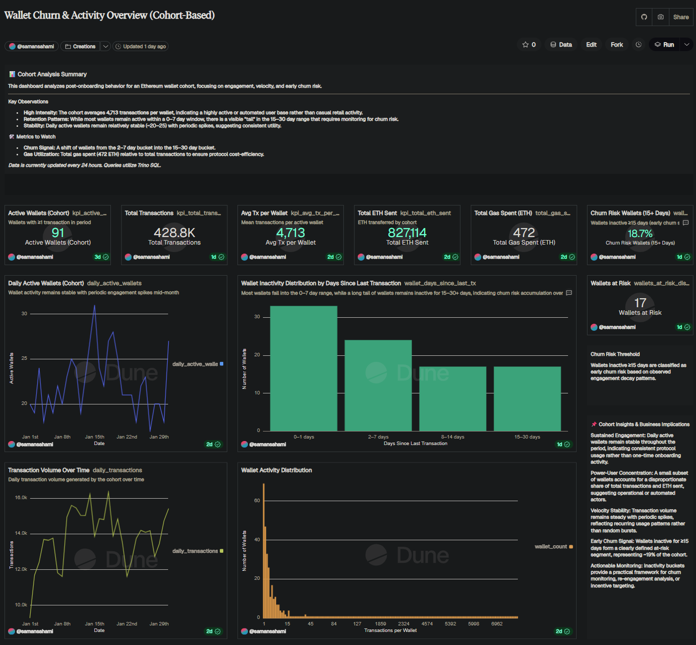

\# Wallet Churn Analytics Pipeline

End-to-end analytics pipeline analyzing crypto wallet churn behavior, from raw transaction ingestion to feature engineering, modeling, and analytics-ready tables.

\## Project Overview

This project demonstrates an analytics-engineering style workflow:

\- Python ETL for transaction ingestion

\- Feature engineering for wallet behavior

\- dbt-style analytics layer

\- Churn modeling \& product insights

\- Designed for Web3 / crypto analytics use cases

## 📊 Dashboard & Insights

- **Dune Analytics Dashboard:**  
  [Wallet Churn & Activity Overview (Cohort-Based)](dashboard/dune_dashboard_link.md)

- 🔗 **Live Dashboard (Dune):**  
  https://dune.com/samansahami/wallet-churn-and-activity-overview-cohort-based

**What this shows:**
- Cohort-level wallet engagement and activity trends
- Inactivity buckets (0–30+ days) used to identify early churn risk
- KPI cards highlighting transactions, ETH volume, and gas usage
- Early churn signals for wallets inactive ≥15 days

> This dashboard represents the **final analytics layer** of the pipeline, consuming analytics-ready tables produced by the Python ETL and dbt-style transformations.

\## Project Structure

wallet-churn-pipeline/

│

├── etl/ # Python ETL \& feature engineering

├── data\_samples/ # Sample input data

├── notebooks/ # Exploratory \& modeling notebooks

├── README.md

\## Notebooks

1\. Wallet churn exploration

2\. Feature engineering

3\. Modeling \& evaluation

4\. Product growth insights

5\. SQL/dbt analytics layer

\## Tech Stack

\- Python (pandas, numpy, sqlalchemy)

\- PostgreSQL

\- dbt-style transformations

\- Jupyter

\- Git \& GitHub

\## Next Steps

\- Publish dbt models

\- Build Dune dashboard for on-chain analytics

## Data Quality & Reliability

This pipeline is designed with analytics-engineering best practices to ensure reliable downstream usage:

- Deterministic feature transformations (no notebook state dependency)
- Explicit churn definition applied consistently across models
- Schema-aware analytics tables to prevent null primary keys and duplicated wallets
- Reproducible feature logic suitable for automation and CI/CD extension

The architecture is intentionally designed to support automated testing and deployment as a next step.

